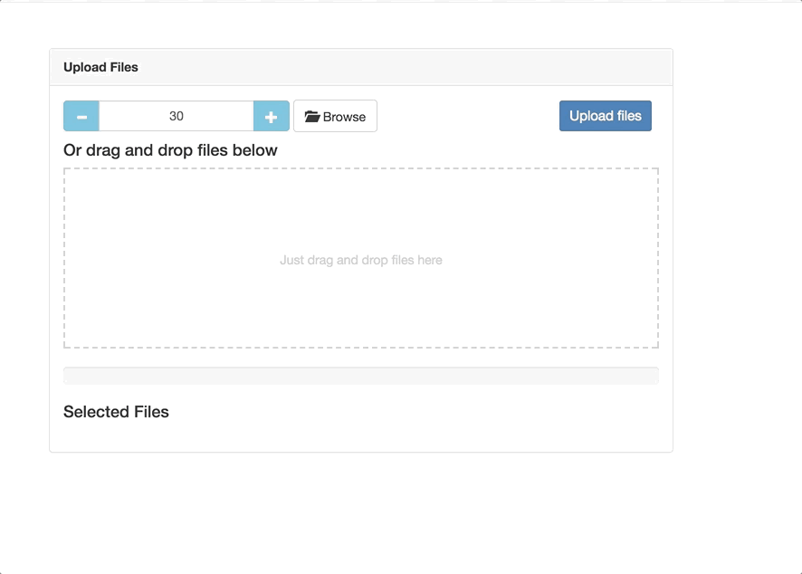
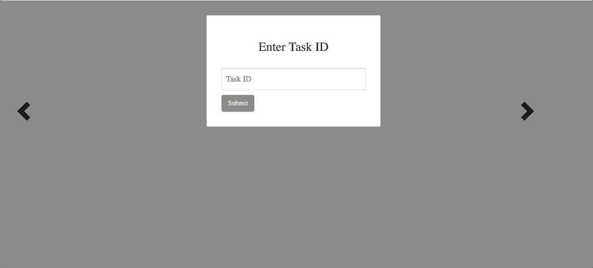

# Introduction

Machine learning or statistics-based projects usually rely on a large amount of labeled data. One of the upcoming challenges of the ever-growing field is to obtain reliable labeled information in a world where most of the data is unstructured. Amazon Mechanical Turk is one of the tools that are constantly used for labeling information: it provides an inexpensive and fast way to reach long and usually time-consuming tasks. However, when it comes to crowdsourcing frameworks, data reliability is a serious and complicated problem to solve. The gravity of reliability is even deeper when the nature of the task relies on multimodal interactions. Evaluating, understanding and annotating the context of multimodal interactions can be a difficult task even for specialized individuals. The idea of this project is to build upon the previous Articulab work for a text annotation framework. The goal is to extend it for multimodal interactions and dive further into the reliability issue. 

# Quick Setup


```
- npm install 
- npm start
```

# Framework Design and Considerations

<i> in progress </i>

# Framework Overview


<b>Articulab Interface</b>
- Video Upload: 
- Task Creation: 

<br>

<b>Turker Interface</b>
- Task Interface: 


# Articulab Interface

<b>Video Upload</b>

<br>



<br>

<h5>User - Uploading Process</h5>

* Click on 'Browse';
* Select a division time <DIV_TIME> on the left of 'Browse' (i.e. 30 will divide each video into 30 second chunks);
* Select or drag all the target mp4 video files <FILENAME>.mp4 that will be divided into <DIV_TIME>;
* Select a target transcription for each video <FILENAME>.csv with the same name as the original .mp4 file; 
* Click upload files;
* Wait until the loading bar is complete to create a task.


<h5>Video Requirements</h5>
* format should be .mp4;

<h5>Transcriptions Requirements</h5>

* format should be .csv;
* Same name as related video;
* Each row should follow the format: start time (s), end time (s), text (string);


<br>

<h5>Backend - Uploading Process</h5>

* Separate the .mp4 and .csv files
* Return the expected time to finish to the frontend (34s for each 1 min of video)
* Save each .mp4 video file on the videos folder with a generated video id name.
* Use ThumbnailGenerator to create a thumbnail for each video on the thumbnails folder;
* For each video, create a specific folder with the format '<DIV_TIME>_<VIDEO_ID>_vd'; 
* Use ffmpeg to divide each video into <DIV_TIME> chunks and save them on their specific folder; 
* Use ThumbnailGenerator to create a thumbnail for each divided video on the thumbnails folder;
* Match each transcription with the respective video;
* Save each .csv transcription file on the transcriptions folder with the previously generated video id name.
* For each transcription, create a specific folder with the format '<DIV_TIME>_<VIDEO_ID>_tr'; 
* Use fs to divide each transcription file into <DIV_TIME> chunks and save them on their specific folder;

<br>

<b>Task Creation</b>


<br>


<br>

<h5>User - Task Creation</h5>

* Select the thumbnail of a video for task (or group of videos that will have the same task specifications);
* Select the <DIV_TIME> of the task (only available for the previously uploaded divisions);
* Select if the evaluation will be on sentence-level or frame-level;
* Select if the evaluation will be on categorical or numerical values;
* Select the values that will be labeled.

<br>

<h5>Backend - Task Creation</h5>

* Collect the information from the user on a JSON object (frontend):

```json
"classic-8ffa7d08-2658" : {
      "categories" : [ "SOJE", "FDFD" ],
      "div_time" : "30",
      "help_video_id" : "8d70f3c8-",
      "level_type" : "Sentence",
      "price" : "10"
```

* Send the object (frontend);
* Create an entry sub_videos on the JSON object;
* Located the respective division folder for transcriptions and videos and save content on a JSON object;
* Merge the two JSON objects:

```json
"classic-8ffa7d08-2658" : {
      "categories" : [ "SOJE", "FDFD" ],
      "div_time" : "30",
      "help_video_id" : "8d70f3c8-",
      "level_type" : "Sentence",
      "price" : "10",
      "sub_videos" : {
        "video_0" : {
          "id" : "div_classic_0",
          "sentence_intervals" : [ [ 0.1, 5.5 ], [ 22.3, 28 ] ],
          "sentences" : [ "ok how are you", "fine, thanks" ]
        },
        "video_1" : {
          "id" : "div_classic_1",
          "sentence_intervals" : [ [ 0.1, 5.5 ], [ 22.3, 28 ] ],
          "sentences" : [ "ok how are you", "fine, thanks" ]
        },
        "video_2" : {
          "id" : "div_classic_2",
          "sentence_intervals" : [ [ 0.1, 5.5 ], [ 22.3, 28 ] ],
          "sentences" : [ "ok how are you", "fine, thanks" ]
        },
        "video_3" : {
          "id" : "div_classic_3",
          "sentence_intervals" : [ [ 0.1, 5.5 ], [ 22.3, 28 ] ],
          "sentences" : [ "ok how are you", "fine, thanks" ]
        }
      },
      "time_to_complete" : "800",
      "type:" : "categorical",
      "video_id" : "classic"
    }
```

* Save the results on Firebase.

# Turker Interface (WILL BE CHANGED IN A FEW DAYS)

<b>Task Hit Interface</b>

<br>



<br>

<br>


<br>

<br>


<br>

<h5>Turker - Task Hit</h5>

* Enter the specified task ID;
* For each subdivision of the video, annotate with the correct label;
* Click on a sentence to play the specific respective part of the video;
* After each subdivision, press the next arrow to go forward or backward to change a previous label;
* When the task is complete, the submit button will be available;
* Click submit to finalize the task.

<br>

<h5>Backend - Task Hit </h5>

* Get the task ID;
* Call the task by the ID from Firebase;
* Load the task (frontend);
* Link each sentence with a start/stop time (frontend);
* When the task is complete, update the json with the predicted labels;
* Save the final result from Firebase.

<br>


# Firebase

<i> in progress </i>

# TO-DO

<i> in progress </i>

# Future Work and Considerations

<i> in progress </i>
